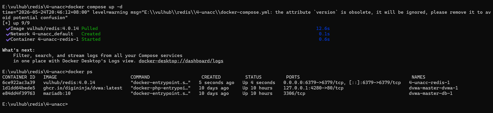
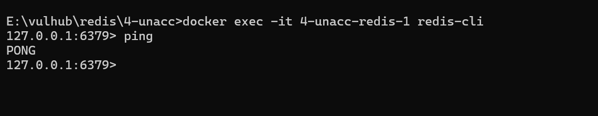
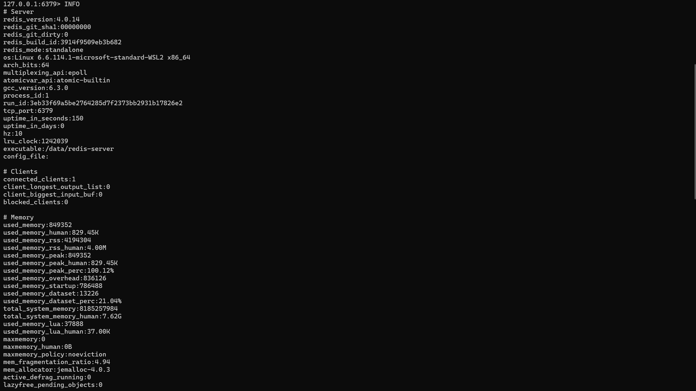
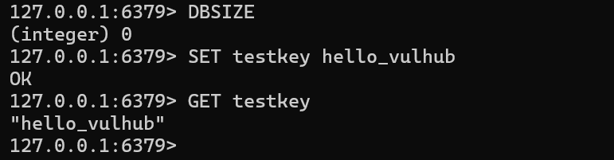

# Vulhub Redis Unauthorized Access Lab

## 项目介绍

本项目基于 Vulhub 搭建 Redis 未授权访问漏洞复现环境，对 Redis 服务在未设置认证、端口暴露等情况下产生的未授权访问风险进行安全验证与分析。

本项目主要完成：

- 下载并使用 Vulhub 漏洞环境；
- 使用 Docker Compose 启动 Redis 未授权访问漏洞环境；
- 查看 Redis 容器运行状态与端口映射；
- 使用 redis-cli 连接 Redis 服务；
- 验证无需密码即可访问 Redis；
- 执行 PING、INFO、DBSIZE、SET、GET 等安全测试命令；
- 分析 Redis 未授权访问漏洞成因；
- 总结 Redis 安全加固建议；
- 整理实验截图、命令记录和漏洞复现报告。

---

## 技术栈

- Windows 11
- Docker Desktop
- Docker Compose
- Vulhub
- Redis
- redis-cli
- Git / GitHub

---

## 项目环境

| 组件 | 说明 |
|---|---|
| 操作系统 | Windows 11 |
| 容器环境 | Docker Desktop |
| 漏洞环境 | Vulhub |
| 漏洞服务 | Redis |
| 默认端口 | 6379 |
| 测试工具 | redis-cli |
| 漏洞类型 | 未授权访问 |

---

## 项目结构

```text
vulhub_redis_unauthorized_lab/
│
├── README.md
├── payloads/
│   └── redis_commands.txt
├── reports/
│   └── redis_unauthorized_report.md
└── screenshots/
    ├── docker_redis_running.png
    ├── redis_unauthorized_ping.png
    ├── redis_info_success.png
    └── redis_set_get_success.png
```

---

## 一、Vulhub 简介

Vulhub 是一个基于 Docker 的漏洞复现环境集合，包含 Redis、Tomcat、Fastjson、Log4j2、Spring、ThinkPHP 等多种真实漏洞环境。

相比 DVWA，Vulhub 更接近真实漏洞复现：

```text
DVWA：适合学习 Web 基础漏洞
Vulhub：适合复现真实服务漏洞和 CVE 漏洞
```

本项目选择 Redis 未授权访问漏洞作为 Vulhub 真实漏洞复现的入门项目。

---

## 二、Redis 未授权访问漏洞简介

Redis 是一种常见的内存数据库，默认端口通常为：

```text
6379
```

Redis 未授权访问漏洞指的是：

```text
Redis 服务暴露在网络中，并且没有设置认证或访问控制，导致攻击者无需密码即可连接 Redis 服务。
```

如果 Redis 未设置密码、监听地址配置不安全，并且防火墙没有限制访问来源，就可能导致未授权访问风险。

本实验只进行安全验证，包括：

- 连接 Redis；
- 执行 PING；
- 查看 Redis 基础信息；
- 写入测试数据；
- 读取测试数据。

不进行破坏性操作。

---

## 三、下载 Vulhub

建议将 Vulhub 下载到 E 盘。

打开 CMD 或 PowerShell，执行：

```bash
cd /d E:\
git clone --depth 1 https://github.com/vulhub/vulhub.git
```

下载完成后，会生成目录：

```text
E:\vulhub
```

---

## 四、进入 Redis 漏洞目录

进入 Redis 未授权访问漏洞目录：

```bash
cd /d E:\vulhub\redis\4-unacc
```

如果目录不存在，可以先查看 Redis 目录：

```bash
dir E:\vulhub\redis
```

然后根据实际目录名称进入对应漏洞环境。

---

## 五、启动 Redis 漏洞环境

在 Redis 未授权访问目录下执行：

```bash
docker compose up -d
```

启动完成后，查看容器状态：

```bash
docker ps
```

如果看到 Redis 容器正在运行，并且端口映射类似：

```text
0.0.0.0:6379->6379/tcp
```

说明 Redis 漏洞环境启动成功。

实验截图：



---

## 六、连接 Redis

### 方法一：本机安装了 redis-cli

如果 Windows 本机已经安装 redis-cli，可以执行：

```bash
redis-cli -h 127.0.0.1 -p 6379
```

进入 Redis 后输入：

```bash
PING
```

如果返回：

```text
PONG
```

说明连接成功。

---

### 方法二：使用容器内 redis-cli

如果本机没有 redis-cli，可以直接使用 Redis 容器内置的 redis-cli。

先查看容器名称：

```bash
docker ps
```

然后执行：

```bash
docker exec -it 容器名 redis-cli
```

示例：

```bash
docker exec -it redis-4-unacc-redis-1 redis-cli
```

进入 Redis 命令行后执行：

```bash
PING
```

如果返回：

```text
PONG
```

说明 Redis 可以在未认证情况下被访问。

实验截图：



---

## 七、验证未授权访问

### 1. PING 测试

```bash
PING
```

预期返回：

```text
PONG
```

说明 Redis 服务可以正常连接。

如果没有要求输入密码，说明 Redis 存在未授权访问风险。

---

### 2. 查看 Redis 信息

执行：

```bash
INFO
```

如果无需认证即可查看 Redis 版本、系统信息、连接信息等内容，说明 Redis 存在信息泄露风险。

实验截图：



---

### 3. 查看数据库 Key 数量

执行：

```bash
DBSIZE
```

可能返回：

```text
(integer) 0
```

该命令用于查看当前 Redis 数据库中的 Key 数量。

---

### 4. 写入测试数据

执行：

```bash
SET testkey hello_vulhub
```

如果返回：

```text
OK
```

说明当前连接具有写入权限。

---

### 5. 读取测试数据

执行：

```bash
GET testkey
```

如果返回：

```text
"hello_vulhub"
```

说明可以读取 Redis 中的数据。

实验截图：



---

## 八、实验结果分析

通过本实验可以确认：

```text
Redis 服务无需认证即可连接；
Redis 支持未授权执行 PING；
Redis 支持未授权执行 INFO；
Redis 支持未授权执行 SET；
Redis 支持未授权执行 GET。
```

这说明当前 Redis 环境存在未授权访问风险。

本实验只使用安全测试命令验证漏洞存在，没有执行破坏性操作。

---

## 九、漏洞成因分析

Redis 未授权访问通常由以下原因造成：

1. Redis 未设置访问密码；
2. Redis 监听地址配置不安全；
3. Redis 服务端口 6379 暴露到外部网络；
4. 防火墙或安全组没有限制访问来源；
5. Docker 容器部署时错误映射端口；
6. 运维人员忽略 Redis 默认安全配置。

正常情况下，Redis 不应该允许任意客户端直接连接并执行命令。

---

## 十、漏洞危害

Redis 未授权访问可能造成：

- Redis 中缓存数据泄露；
- Redis 中业务数据被读取；
- Redis 中数据被恶意修改；
- Redis 数据被删除；
- 服务稳定性受到影响；
- 敏感配置或业务状态泄露；
- 在错误配置情况下可能进一步扩大攻击面。

在真实环境中，Redis 未授权访问属于高风险配置问题。

---

## 十一、防御建议

为了防止 Redis 未授权访问，应采取以下措施：

1. 设置 Redis 访问密码；
2. 不将 Redis 服务暴露到公网；
3. 使用防火墙或安全组限制访问来源；
4. 将 Redis 绑定到本地地址或内网地址；
5. 容器部署时避免不必要的端口映射；
6. 禁用或重命名高风险命令；
7. 使用最小权限原则运行 Redis；
8. 定期检查开放端口；
9. 对 Redis 访问日志进行监控。

---

## 十二、停止实验环境

实验结束后，回到 Redis 漏洞目录：

```bash
cd /d E:\vulhub\redis\4-unacc
```

执行：

```bash
docker compose down -v
```

该命令会停止 Redis 漏洞容器并清理相关数据卷。

---

## 项目总结

本项目完成了 Vulhub Redis 未授权访问漏洞的基础复现与分析。

通过本实验，掌握了：

- Vulhub 漏洞环境的下载和使用方式；
- Docker Compose 启动真实漏洞环境的方法；
- Redis 默认端口和基本连接方式；
- redis-cli 的基础使用；
- Redis 未授权访问的验证方法；
- PING、INFO、DBSIZE、SET、GET 等基础命令；
- Redis 未授权访问漏洞的成因；
- Redis 服务的安全加固方式。

本实验是从 DVWA 基础漏洞复现过渡到 Vulhub 真实漏洞复现的重要一步。

---

## 免责声明

本项目仅用于 Web 安全学习、漏洞复现和安全研究，禁止用于任何非法用途。